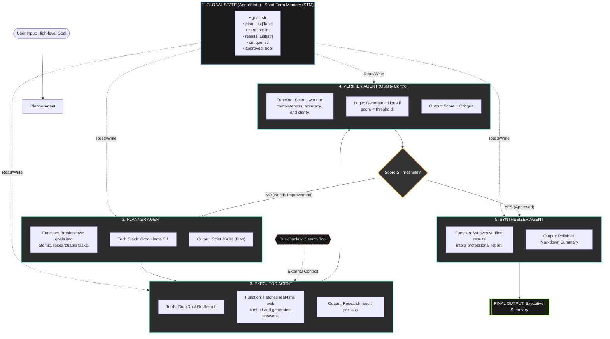

# 🤖 AI Multi-Agent Research Assistant

**Goal**: Deliver accurate, well-researched, and well-structured answers through iterative planning, execution, verification, and synthesis.

---

## 🏛️ High-Level Architecture

This system leverages a state-of-the-art multi-agent design, utilizing **LangGraph** for orchestration, **Groq Llama 3.1** for reasoning, and **DuckDuckGo** for real-time information retrieval.



---

## 🛠️ Agent Responsibilities

### 1. **Global State (STM)**
Acts as the "Source of Truth" shared across all agents. It stores the user's objective, the generated research plan, raw results, and the iterative feedback loop history.

### 2. **Planner Agent**
- **Objective**: Strategic decomposition.
- **Output**: A structured list of tasks designed to eliminate ambiguity and maximize research depth.

### 3. **Executor Agent**
- **Objective**: Grounded execution.
- **Capability**: Utilizes the **DuckDuckGo Search** tool to pull live data, ensuring the assistant isn't limited by its training data cutoff.

### 4. **Verifier Agent (The Evaluator)**
- **Objective**: Quality assurance.
- **Logic**: It performs a critical audit of the research. If the content is hallucinated or incomplete, it forces a "Critique Loop" to re-plan and re-execute.

### 5. **Synthesizer Agent**
- **Objective**: Executive presentation.
- **Output**: Transforms fragmented data points into a cohesive, professional Markdown report suitable for high-stakes decision-making.

---

## 🚀 Getting Started

1. **Setup Environment**:
   ```bash
   pip install langgraph langchain-groq python-dotenv duckduckgo-search ddgs
   ```
2. **API Configuration**:
   Add your `GROQ_API_KEY` to a `.env` file.
3. **Execution**:
   ```bash
   python langchain_agentState.py
   ```
