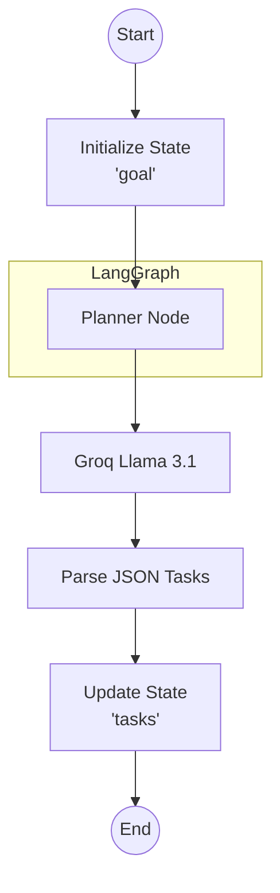

# LangChain Agent State & Planner Explained

This project demonstrates a basic agentic workflow using **LangGraph**, **LangChain**, and **Groq**. It uses a "Planner" agent to break down a high-level goal into a series of actionable tasks.

## 📊 Workflow Diagram



---

## 📝 Line-by-Line Explanation

### 1. Imports and Setup
- **`import os`**: Used to interact with the operating system (though in this script, the key is hardcoded for demonstration).
- **`from dotenv import load_dotenv`**: Loads environment variables from a `.env` file (like API keys).
- **`from typing import TypedDict, List`**: Imports types to define the "State" of our agent. `TypedDict` ensures our state has specific keys.

### 2. LangChain & LangGraph Imports
- **`from langgraph.graph import StateGraph, END`**: The core of LangGraph. `StateGraph` creates the workflow, and `END` marks where it stops.
- **`from langchain_openai import ChatOpenAI`**: (Imported but not used here, used for OpenAI models).
- **`from langchain_core.messages import SystemMessage, HumanMessage`**: Classes to format messages for the AI (System instructions vs. User input).
- **`from langchain_community.tools import DuckDuckGoSearchRun`**: A tool that allows the agent to search the web (available for future nodes).
- **`from langchain_groq import ChatGroq`**: The driver to connect LangChain to Groq's fast Llama models.

### 3. LLM Initialization
- **`load_dotenv()`**: Triggers the loading of the `.env` file.
- **`llm = ChatGroq(...)`**: Creates the "brain" of the agent. 
    - `model="llama-3.1-8b-instant"`: Uses Meta's Llama 3.1 model.
    - `api_key="..."`: Authenticates your request.
    - `temperature=0`: Makes the output predictable and focused (best for planning).

### 4. Defining the State (`AgentState`)
The **State** is a shared "memory" that every node in the graph can read from and write to.
- `goal`: What the user wants.
- `tasks`: The list of steps generated by the planner.
- `results`: Where actual work data would be stored.
- `critique`: Feedback on the work.
*This ensures all parts of the agent stay on the same page.*

### 5. The Planner Node (`planner`)
This is a Python function that acts as a "Node" in our graph.
- **System Prompt**: Tells the AI exactly how to behave ("You are a planning agent... Respond only with JSON").
- **LLM Call**: Sends the goal to the LLM.
- **JSON Parsing**: The LLM returns a string. We use `json.loads` to turn that string into a Python list of tasks.
- **Return**: The function returns the updated state with the new `tasks`.

### 6. Building the Graph
- **`graph = StateGraph(AgentState)`**: Initializes a new workflow that uses our `AgentState` schema.
- **`graph.add_node("planner", planner)`**: Registers our function as a node named "planner".
- **`graph.set_entry_point("planner")`**: Tells the graph where to start.
- **`graph.add_edge("planner", END)`**: Tells the graph to stop after the planner is done.
- **`app = graph.compile()`**: Turns the blueprint into an executable application.

### 7. Execution Block
- **`initial_state = { ... }`**: Defines the starting data (the user's goal).
- **`app.invoke(initial_state)`**: Starts the engine! It flows through the graph and returns the final state.
- **Printing**: The script finally loops through the generated tasks and prints them to your console.

---

## 🚀 How to Run
1. Install dependencies:
   ```bash
   pip install langgraph langchain-groq python-dotenv duckduckgo-search
   ```
2. Run the script:
   ```bash
   python langchain_agentState.py
   ```
