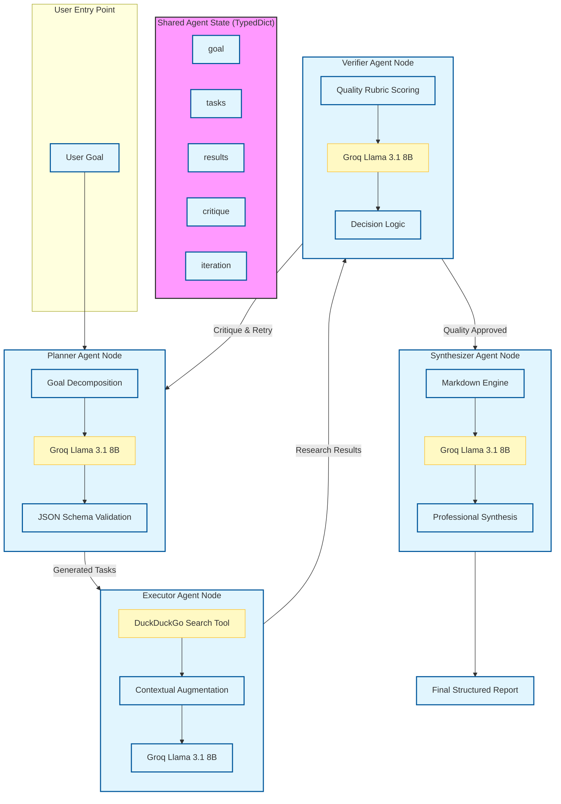

# 🚀 Production-Grade LangChain Agentic Workflow

This repository implements a sophisticated, multi-agent research and synthesis pipeline using **LangGraph**, **LangChain**, and **Groq**. The system is designed for iterative quality improvement through a Planner-Executor-Verifier-Synthesizer architecture.

## 📊 System Architecture

The following diagram illustrates the production-level flow of data and control within the agentic system, highlighting the internal components of each node.



---

## 📝 Component Breakdown

### 1. **Global State (`AgentState`)**
The backbone of the system, acting as a "Short-Term Memory" (STM) shared across all nodes. It maintains source traceability, task lists, and iterative critique history.

### 2. **Planner Agent**
- **Function**: Breaks down high-level user goals into a sequence of atomic, researchable tasks.
- **Tech Stack**: Uses **Groq Llama 3.1** with a strict JSON-only output format to ensure downstream compatibility.

### 3. **Executor Agent**
- **Tools**: Integrated with **DuckDuckGo Search** for real-time web research.
- **Function**: Iterates through the plan, fetches external context, and uses the LLM to generate grounded, fact-based answers for each sub-task.

### 4. **Verifier Agent (Quality Control)**
- **Function**: Acts as a "Human-in-the-loop" simulator. It scores the work based on *completeness*, *accuracy*, and *clarity*.
- **Logic**: If the score is below the threshold, it generates a `critique` and loops back to the Planner for a refined approach.

### 5. **Synthesizer Agent**
- **Function**: The final polish. It takes fragmented research results and weaves them into a professional, executive-level Markdown summary.

---

## 🛠️ Installation & Setup

1. **Clone the repository**:
   ```bash
   git clone https://github.com/Avichatt/langchain-agentstate.git
   ```
2. **Install Dependencies**:
   ```bash
   pip install langgraph langchain-groq python-dotenv duckduckgo-search ddgs
   ```
3. **Environment Configuration**:
   Create a `.env` file in the root directory:
   ```env
   GROQ_API_KEY=your_api_key_here
   ```
4. **Run the System**:
   ```bash
   python langchain_agentState.py
   ```
